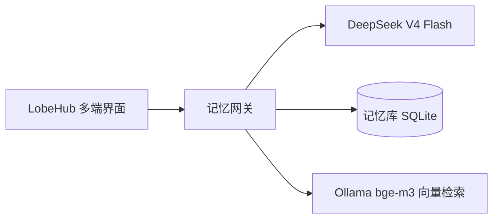

# 虚拟恋人 · AI Companion

一个本地自托管的 AI 虚拟恋人框架：基于 LobeHub 多端聊天界面 + 自研记忆网关，让任意 AI 角色拥有长期记忆、人格和跨会话回忆能力。

> 角色完全可自定义。仓库内置「喜多郁代」（《孤独摇滚！》）作为示例角色，你可以用任何动漫角色、原创角色或完全自创的人格替换——只需一份角色设定 Markdown（见「自定义角色」）。

## 功能

- 💬 三端互通：Web / 桌面 / 手机 PWA 共用同一账号、会话和记忆
- 🧠 长期记忆：对话后自动提取重要信息（偏好、事件、约定），下次聊天自动回忆
- 🎭 自定义角色：任意角色卡即可塑造（内置喜多郁代示例人格卡 + 知识库）
- 🔍 本地向量检索：Ollama + bge-m3，记忆与知识库检索全部本地完成
- ⏱ 一键启动：重启电脑后双击 `gateway/start.bat` 全部恢复

## 需要的工具（前置条件）

| 工具 | 用途 | 建议 |
|---|---|---|
| Docker Desktop（Windows）/ Docker（Linux） | 运行 LobeHub 全套服务 | 必需。Windows 用户需 WSL2 |
| Ollama | 本地向量模型 bge-m3（记忆与知识库的向量化） | 必需，免费且数据不出本机 |
| Python 3.12+ | 运行记忆网关 | 必需 |
| DeepSeek API Key | 对话主力模型 | 必需（见下方模型建议） |
| Git | 版本管理 / 上传 GitHub | 开发必需 |
| Node.js 18+ | 未来微信 iLink 桥接 | 可选（路线图中） |
| 浏览器 | 访问 LobeHub 界面 | 任意现代浏览器即可 |

## 模型建议

**对话模型：DeepSeek V4 Flash（推荐）**

- 便宜：缓存命中输入 0.02 元/百万 token，输出 2 元/百万 token（2026-08 价格）
- 原生 1M 超长上下文，中文表现好，OpenAI 兼容接口
- 注意：它是纯文本模型，不能直接看图（图片理解在路线图中，将通过视觉模型转述实现）

**向量模型：本地 Ollama + bge-m3（推荐，不要用 API 向量模型）**

- bge-m3 是多语言向量模型（1024 维），中文效果好
- 本地跑：免费、隐私、无延迟；0.6B 级别 CPU 就能跑，不需要显卡
- 命令：`ollama pull bge-m3`
- 若用 LobeHub 知识库，在 Ollama 供应商中把 bge-m3 配置为 embedding 模型

**可选：本地对话小模型（有 GPU 时）**

- 6GB 显存可跑 8B 级模型（Qwen3-8B / GLM-4-9B，q4 量化），用于记忆整理等批量任务
- 无 GPU 时直接用 DeepSeek API 完成这些任务即可

## 部署建议

### 本地体验（当前状态）

全部跑在本机，适合开发与验证。重启电脑后双击 `gateway/start.bat` 一键恢复。

### 云服务器（正式使用，推荐）

虚拟恋人需要 7×24 在线，建议迁移到云服务器：

- **规格**：4 核 8GB 起（2 核 4GB 可跑但紧张），系统 Ubuntu 22.04 LTS
- **购买**：国内轻量服务器（腾讯云/阿里云）促销价约 200-400 元/年
- **迁移**：整个项目复制到服务器，`docker compose up -d` 即可（数据在 `lobehub/data/`，一起带走）
- **域名与 HTTPS**：建议配一个域名 + Caddy/Nginx 反向代理，`APP_URL`、`S3_ENDPOINT` 改为公网地址，`INTERNAL_APP_URL` 保持容器内地址
- **移动端**：手机浏览器访问域名（PWA 可添加到主屏幕）；后续可接微信 iLink 作为手机主通道
- **注意**：国内云服务器访问 DeepSeek API 无需代理；若需访问境外服务，单独配置代理且不要让代理环境变量进入容器（本项目 compose 已显式清空容器代理）

## 隐私说明

- `.env`（含 API Key、登录密钥）已被 `.gitignore` 排除，**不会**上传到 GitHub
- 记忆数据库（`memory.db`）、Postgres 数据（`lobehub/data/`）同样被排除
- 角色卡为角色扮演设定（示例角色来自公开动漫作品），无隐私风险
- 仓库公开后，其他人无法看到你的密钥和对话数据

## 架构



## 目录结构

```
virtual-companion/
├── lobehub/          # LobeHub 自托管（Docker Compose：Postgres + Redis + RustFS + SearXNG）
│   ├── docker-compose.yml
│   ├── .env.example  # 复制为 .env 后填写密钥
│   └── data/         # PostgreSQL 数据（运行时生成，不入 Git）
├── gateway/          # 记忆网关（Python FastAPI，OpenAI 兼容接口）
│   ├── main.py       # 网关入口：记忆注入 + 转发 + 异步提取
│   ├── memory_store.py  # SQLite 记忆库 + 向量检索
│   ├── start.bat     # Windows 一键启动脚本
│   └── .env.example  # 复制为 .env 后填写 DeepSeek API Key
├── persona/          # 角色资产（示例：喜多郁代）
│   ├── 喜多郁代-人格卡.md    # 系统提示词（Agent 人格）
│   └── SKILL-喜多郁代-完整版.md  # 知识库全文
└── docs/             # 设计方案
```

## 快速开始（本地）

前置条件：Docker Desktop、Node.js、Python 3.12+、Ollama。

1. **部署 LobeHub**：进入 `lobehub/`，复制 `.env.zh-CN.example` 为 `.env`，生成密钥，然后：
   ```bash
   docker compose up -d
   ```
   访问 http://localhost:3210 注册账号，创建你的虚拟恋人 Agent（系统提示词用 `persona/` 下的角色卡），并启用 Memory 插件与知识库。

2. **本地向量模型**：
   ```bash
   ollama pull bge-m3
   ```
   在 LobeHub 的 Ollama 供应商中配置 `http://host.docker.internal:11434`，将 bge-m3 设为 embedding 模型。

3. **启动记忆网关**：
   ```bash
   cd gateway
   python -m venv .venv
   .venv\Scripts\pip install -r requirements.txt
   copy .env.example .env   # 填写 DEEPSEEK_API_KEY
   .venv\Scripts\python main.py
   ```

4. **接入网关**：在 LobeHub 的 DeepSeek 供应商中，把 API 地址改为 `http://host.docker.internal:8080`（LobeHub 在容器内，通过 host.docker.internal 访问宿主机网关）。之后所有对话自动获得记忆能力。

## 日常使用

重启电脑后，双击 `gateway/start.bat`，脚本会自动：拉起 Docker Desktop → 恢复 LobeHub 容器 → 启动记忆网关 → 打开浏览器。

查看她记住了什么：访问 http://localhost:8080/api/memories

## 自定义角色

这个项目不绑定任何特定角色。想换一个恋人，只需三步：

1. **写一份角色卡**：Markdown 格式，包含角色身份、性格、说话风格、行为模式、知识边界（可参考 `persona/喜多郁代-人格卡.md` 的结构）
2. **在 LobeHub 创建新 Agent**：把角色卡全文粘贴到系统提示词，启用 Memory 插件
3. **（可选）上传完整设定**：把更长的角色资料（原作背景、完整设定）上传到知识库并关联到该 Agent

记忆网关与角色无关——不同 Agent 共享同一套记忆机制，记忆内容按实际对话各自积累。

## 配置说明

| 文件 | 用途 |
|---|---|
| `lobehub/.env` | LobeHub 数据库、S3、密钥配置 |
| `gateway/.env` | DeepSeek API Key、网关端口、记忆检索参数 |

## 路线图

- [x] LobeHub 自托管 + 三端互通
- [x] 示例角色 Agent + 知识库
- [x] 本地 embedding + 知识库 RAG
- [x] 记忆网关（提取 / 检索 / 注入）
- [ ] 图片理解（视觉模型转述）
- [ ] 语音 TTS/STT
- [ ] 微信 iLink 通道（含主动消息）
- [ ] 夜间记忆整理（去重、遗忘、时间线）

## 技术栈

- LobeHub（自托管 Docker Compose）
- DeepSeek V4 Flash（对话）
- Ollama + bge-m3（本地向量）
- Python FastAPI（记忆网关）
- SQLite（记忆库）
