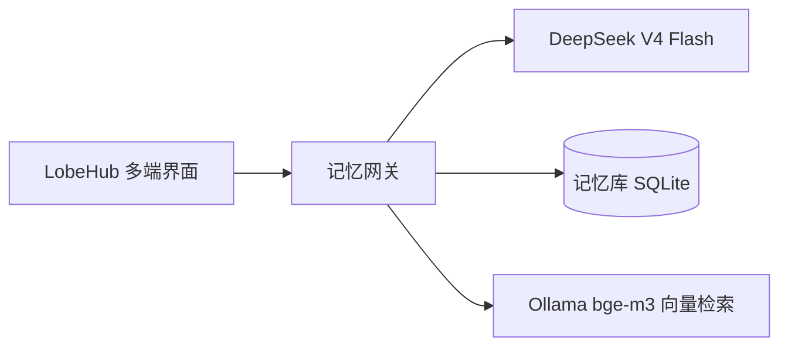

# 虚拟恋人 · 喜多郁代

一个本地自托管的 AI 虚拟恋人项目：基于 LobeHub 多端聊天界面 + 自研记忆网关，让 AI 角色拥有长期记忆、角色人格和跨会话回忆能力。

## 功能

- 💬 三端互通：Web / 桌面 / 手机 PWA 共用同一账号、会话和记忆
- 🧠 长期记忆：对话后自动提取重要信息（偏好、事件、约定），下次聊天自动回忆
- 🎸 角色扮演：喜多郁代人格卡 + 完整设定知识库（RAG）
- 🔍 本地向量检索：Ollama + bge-m3，记忆与知识库检索全部本地完成
- ⏱ 一键启动：重启电脑后双击 `gateway/start.bat` 全部恢复

## 架构



## 目录结构

```
virtual-companion/
├── lobehub/          # LobeHub 自托管（Docker Compose：Postgres + Redis + RustFS + SearXNG）
│   ├── docker-compose.yml
│   ├── .env.example  # 复制为 .env 后填写密钥
│   └── data/         # PostgreSQL 数据（运行时生成，不入 Git）
├── gateway/          # 记忆网关（Python FastAPI，OpenAI 兼容接口）
│   ├── main.py       # 网关入口：记忆注入 + 转发 + 异步提取
│   ├── memory_store.py  # SQLite 记忆库 + 向量检索
│   ├── start.bat     # Windows 一键启动脚本
│   └── .env.example  # 复制为 .env 后填写 DeepSeek API Key
├── persona/          # 角色资产
│   ├── 喜多郁代-人格卡.md    # 系统提示词（Agent 人格）
│   └── SKILL-喜多郁代-完整版.md  # 知识库全文
└── docs/             # 设计方案
```

## 快速开始（本地）

前置条件：Docker Desktop、Node.js、Python 3.12+、Ollama。

1. **部署 LobeHub**：进入 `lobehub/`，复制 `.env.zh-CN.example` 为 `.env`，生成密钥，然后：
   ```bash
   docker compose up -d
   ```
   访问 http://localhost:3210 注册账号，创建「喜多郁代」Agent（系统提示词用 `persona/喜多郁代-人格卡.md`），并启用 Memory 插件与知识库。

2. **本地向量模型**：
   ```bash
   ollama pull bge-m3
   ```
   在 LobeHub 的 Ollama 供应商中配置 `http://host.docker.internal:11434`，将 bge-m3 设为 embedding 模型。

3. **启动记忆网关**：
   ```bash
   cd gateway
   python -m venv .venv
   .venv\Scripts\pip install -r requirements.txt
   copy .env.example .env   # 填写 DEEPSEEK_API_KEY
   .venv\Scripts\python main.py
   ```

4. **接入网关**：在 LobeHub 的 DeepSeek 供应商中，把 API 地址改为 `http://host.docker.internal:8080`（LobeHub 在容器内，通过 host.docker.internal 访问宿主机网关）。之后所有对话自动获得记忆能力。

## 日常使用

重启电脑后，双击 `gateway/start.bat`，脚本会自动：拉起 Docker Desktop → 恢复 LobeHub 容器 → 启动记忆网关 → 打开浏览器。

查看她记住了什么：访问 http://localhost:8080/api/memories

## 配置说明

| 文件 | 用途 |
|---|---|
| `lobehub/.env` | LobeHub 数据库、S3、密钥配置 |
| `gateway/.env` | DeepSeek API Key、网关端口、记忆检索参数 |

## 路线图

- [x] LobeHub 自托管 + 三端互通
- [x] 喜多角色 Agent + 知识库
- [x] 本地 embedding + 知识库 RAG
- [x] 记忆网关（提取 / 检索 / 注入）
- [ ] 图片理解（视觉模型转述）
- [ ] 语音 TTS/STT
- [ ] 微信 iLink 通道（含主动消息）
- [ ] 夜间记忆整理（去重、遗忘、时间线）

## 技术栈

- LobeHub（自托管 Docker Compose）
- DeepSeek V4 Flash（对话）
- Ollama + bge-m3（本地向量）
- Python FastAPI（记忆网关）
- SQLite（记忆库）
