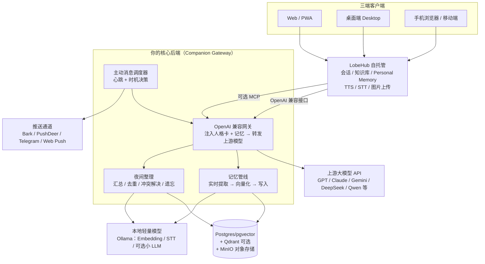

# 虚拟恋人项目方案 v1.0

> 日期：2026-08-06
> 目标：基于 API 搭建一个「三端互通、不失忆、可语音、会主动找你、能看懂图片」的虚拟恋人。
> 参考资产：你之前的 SKILL.md（喜多郁代角色卡），可完整复用为恋人的人格层。

---

## 一、结论速览（TL;DR）

1. **前端用 LobeHub（原 LobeChat）**：81k+ star，官方支持 Web / 桌面端 / PWA / 手机浏览器，自托管数据库版（Postgres + Logto + MinIO）可实现真正的三端互通；2026 年已内置白盒式长期记忆（Personal Memory）、知识库 RAG、TTS/STT、图片理解、MCP 插件，并且 2026-08-03 刚合并了「主动推送消息」功能。
2. **记忆不能只靠 RAG**：RAG 只是检索工具。「不失忆」的关键是**分层记忆 + 定时整理**：人格层 / 用户画像层 / 关系事件层 / 对话上下文层，每层有独立的写入、检索、更新策略。
3. **本地轻量模型：建议部署，但不必从第一天就上**。优先级：本地 Embedding（强烈建议，Ollama 跑 bge-m3 或 Qwen3-Embedding-0.6B）→ 本地 STT（可选）→ 本地小 LLM 做记忆整理（有 GPU 就上，没有就先让主 API 顺手做）。你的场景 token 不敏感，记忆提取用主模型 API 起步完全可行。
4. **主动消息有两条路**：用 LobeHub 新合并的主动推送（Telegram/Discord/Slack/微信，刚上线可能还不稳），或自建定时调度器 + Bark/PushDeer/Telegram Bot 推送（成熟可控）。建议后者兜底。
5. **你的 SKILL.md 是现成角色资产**：蒸馏成恋人核心人格卡（系统提示词）+ 完整设定进知识库，两条路同时用。

---

## 二、需求 → 落点映射

| 需求 | 实现落点 | 成熟度 |
|---|---|---|
| 三端互通（最重要） | LobeHub 自托管数据库版：账号登录（Logto）+ 云端数据库（Postgres）+ 对象存储（MinIO），Web/桌面/PWA/手机浏览器共享会话与记忆 | ★★★★☆ 成熟 |
| 长期记忆（不失忆） | LobeHub 内置 Personal Memory + 自研「Companion Gateway」做关系/事件记忆 + 向量检索（pgvector / Qdrant）+ 夜间整理任务 | ★★★☆☆ 需自己搭记忆管线 |
| 语音 | LobeHub 内置 TTS/STT（OpenAI / Edge / Azure / 本地服务）；想要专属恋人音色用 GPT-SoVITS / CosyVoice / fish-speech | ★★★★☆ 成熟 |
| 主动给用户发消息 | 自建定时调度器 + Bark/PushDeer/Telegram Bot/Web Push；或 LobeHub 新合并的主动推送功能 | ★★★☆☆ 新功能需验证 |
| 理解图片 | 接入多模态模型（GPT / Claude / Gemini / Qwen-VL / GLM-4V），LobeHub 原生支持上传图片 | ★★★★★ 成熟 |
| 角色扮演质感 | 复用 SKILL.md 角色卡；LobeHub Agent 支持人格设定 + 插件 + 自定义语气 | ★★★★☆ 成熟 |

---

## 三、整体架构

**核心思路**：LobeHub 负责「好看好用 + 多端」，你的后端负责「灵魂」（人格 + 记忆 + 主动行为）。后端对外暴露一个 OpenAI 兼容接口，LobeHub 里把它配置成一个模型供应商即可，所有端自动生效，前端代码一行不用改。

---

## 四、核心设计：记忆系统（本项目的命根子）

### 4.1 分层记忆模型

把「记忆」拆成五层，每层用不同的工具和更新策略：

| 层级 | 内容 | 存储 | 更新策略 |
|---|---|---|---|
| L1 人格层 | 喜多的性格、口癖、行为模式（来自 SKILL.md） | 静态提示词 + 知识库 | 基本不变，可手动调整 |
| L2 用户画像层 | 你的身份、偏好、作息、重要日期、雷点 | 结构化条目（Postgres / LobeHub Personal Memory） | 实时提取 + 冲突检测 |
| L3 关系事件层 | 共同经历、聊过的重要话题、关系阶段、情绪标记 | 事件表 + 向量库（Qdrant/pgvector） | 实时提取 + 夜间 consolidation |
| L4 对话上下文层 | 最近 N 轮对话 + 滚动摘要 | 会话表 + 摘要缓存 | 每次对话更新，超窗压缩 |
| L5 长期归档 | 历史对话全文（原始数据） | Postgres + MinIO | 只写不删，供夜间提炼 |

> 参考：LobeHub RFC 144 的 CIPEA 框架（身份 / 情境 / 偏好 / 经历 / 活动）与这个分层思路一致；LobeHub 内置 Personal Memory 已落地其中的用户记忆部分，你只需补 L3 关系事件层和 L5 归档。

### 4.2 记忆管线（实时 + 定期）

**实时（每次对话后异步执行，不阻塞回复）：**
1. 用主模型（或本地小模型）从最近对话中抽取结构化记忆：`{事实 / 事件 / 偏好 / 情绪}`，输出 JSON。
2. 去重 + 冲突检测：与现有记忆比对，新事实写入，矛盾条目进入「待解决」。
3. 向量化（本地 embedding）→ 写入事件表 + 向量库。
4. 更新用户画像条目的重要度/置信度。

**定期（每日/每周，低峰执行）：**
1. 汇总当天事件，生成「日记」与关系时间线。
2. 合并相似记忆、删除过期记忆、解决冲突。
3. 把最近 N 轮对话压缩成会话摘要，写回 L4。
4. 根据遗忘曲线降低久未引用的记忆权重（不是删除，而是降权）。

### 4.3 检索注入策略

每次请求时，网关按以下顺序组装上下文（控制总量，避免 token 膨胀反而伤害记忆）：

1. **人格核心卡**（SKILL.md 蒸馏版，2–4k token）
2. **用户画像 Top-K**（高置信度 + 相关度，1–2k token）
3. **关系记忆检索结果**（向量相似度 × 时间衰减 × 重要度，2–3k token）
4. **当前时间 / 天气 / 已有多久没联系**（几百 token，主动行为也依赖它）
5. **近期对话滚动窗口**（最近 10–30 轮，超出的部分用摘要）

这样做的效果：聊天时像恋人一样「记得我们上周说过的事」，同时不会把所有历史都塞进上下文。

### 4.4 与 LobeHub 内置记忆的分工

- **LobeHub Personal Memory**：负责用户偏好/画像，白盒可编辑（你自己在 UI 里就能看到和修改她记了什么）。
- **你的 Gateway**：负责关系/事件记忆（她自己的「日记」、你们的故事），以及注入人格卡。
- 两边都导出/备份，避免单一故障点。

---

## 五、是否要本地部署轻量模型？（结论 + 建议）

### 结论

**需要本地部署，但不是全部。** 分三档：

| 任务 | 建议 | 理由 | 硬件需求 |
|---|---|---|---|
| Embedding（向量化） | **强烈建议本地**（Ollama：bge-m3 或 Qwen3-Embedding-0.6B） | 记忆检索高频大量，用 API 贵、慢、隐私差；0.6B 级别 CPU 都能跑 | 极低，8GB 内存即可 |
| STT（语音转文字） | **建议本地**（SenseVoice / faster-whisper small） | 中文效果好、延迟低、免 API 费用 | 低，CPU 可跑 |
| 记忆提取 / 夜间整理 | **先用主 API，有 GPU 再上本地**（Qwen3-8B / GLM-4-9B 级别） | 主模型提取质量更高，你的场景不差 token；本地 8B 模型适合批量夜间任务和隐私 | 8B q4 ≈ 6GB 显存；20B ≈ 12GB |
| TTS | 可云可本地 | 起步用云端（OpenAI / Edge / 阿里 CosyVoice / MiniMax），想要专属音色再上 GPT-SoVITS | 本地音色克隆需要 6–12GB 显存 |

### 为什么 embedding 一定要本地

记忆系统每分钟都在做向量化：每条消息、每次检索。embedding API 虽然单次便宜，但累计是最大的隐性成本，而且记忆数据是隐私。本地跑一个 0.6B 的 embedding 模型（bge-m3 多语言、Qwen3-Embedding-0.6B 中文更强），延迟 10ms 级别，效果与 API 相当。

### 为什么记忆提取可以先用主 API

记忆提取本质是「让模型读一段对话，输出结构化 JSON」。主模型（GPT-5 / Claude / DeepSeek / Qwen 顶配）在指令遵循上远好于 8B 本地模型，提取出的记忆质量直接决定「不失忆」的上限。你的预算不敏感，所以第一版就让主 API 顺手做；等需要每天跑大量夜间整理、或担心隐私时，再切本地 8B 模型。

### 一句话回答

> 本地轻量模型：**embedding 必上（很小很便宜），STT 建议上，记忆整理可后置**。它解决的是成本、隐私和批量任务，而不是「能不能做」的问题。

---

## 六、GitHub 同类项目调研

### 6.1 直接相关的「虚拟恋人 / 伴侣」项目

| 项目 | Star | 定位 | 值得借鉴的点 |
|---|---|---|---|
| [LobeHub / LobeChat](https://github.com/lobehub/lobehub) | 81k | 开源 AI 聊天框架，Web + 桌面 + PWA + 自托管 | 三端互通、内置 Personal Memory、知识库 RAG、TTS/STT、图片、插件/MCP、2026-08 合并主动推送 |
| [AstrBot](https://github.com/AstrBotDevs/AstrBot) | 39k | AI Agent 框架，桥接 QQ/微信/Telegram 等 IM | 多 IM 通道（手机端最自然）、插件生态；社区有「主动聊天」「私人伴侣」插件 |
| [AIRI](https://github.com/moeru-ai/airi) | 47k | 自托管 AI 伴侣外壳，实时语音 + Live2D/VRM 形象 | 语音优先的伴侣体验、角色形象层、Web/桌面端 |
| [a16z companion-app](https://github.com/a16z-infra/companion-app) | 6k | 官方入门级 AI 伴侣全栈模板 | 人格文件 → 向量库 → 检索注入的标准做法（简单但完整） |
| [SillyTavern](https://github.com/SillyTavern/SillyTavern) | 32k | 角色扮演前端（重度用户向） | 角色卡生态极强；但三端同步需要额外折腾，不如 LobeHub 开箱即用 |
| [Awesome AI Companion](https://github.com/DasterProkio/awesome-ai-companion) | 377 | 长期 AI 伴侣开源项目索引（记忆/情绪/主动消息/语音分类） | 2026 年更新的宝藏清单，含几十个记忆与主动消息项目 |

### 6.2 记忆层项目（直接可用或当架构参考）

| 项目 | Star | 定位 | 用法建议 |
|---|---|---|---|
| [mem0](https://github.com/mem0ai/mem0) | 63k | 通用 AI 记忆层，实时提取 + 多信号检索 + 时间感知 | 最省事的现成记忆服务，Docker 自托管；可做 Gateway 的记忆后端 |
| [Cognee](https://github.com/topoteretes/cognee) | 30k | 知识图谱记忆平台 | 需要「关系推理」时（谁、何时、什么关系）优于纯向量 RAG |
| [Letta（原 MemGPT）](https://github.com/letta-ai/letta) | 24k | 状态化 Agent 平台，内存管理 + 心跳/Cron 主动行为 | 想少写代码时可让 Letta 当运行时，LobeHub 当 UI |
| [Zep](https://github.com/getzep/zep) | 5k | 长期记忆服务（时序知识图谱） | 参考其记忆 API 设计 |
| [OmniDimen/omemo](https://github.com/OmniDimen/omemo) | 0.1k | OpenAI 兼容记忆代理（正是「网关注入记忆」思路） | 新项目，但思路与我们的推荐架构完全一致，可读源码参考 |

### 6.3 语音项目

| 项目 | Star | 用途 |
|---|---|---|
| [GPT-SoVITS](https://github.com/RVC-Boss/GPT-SoVITS) | 61k | 1 分钟音频克隆专属音色（虚拟恋人定制声音的事实标准） |
| [fish-speech](https://github.com/fishaudio/fish-speech) | 32k | SOTA 开源 TTS，多语言 |
| [CosyVoice](https://github.com/FunAudioLLM/CosyVoice) | 23k | 阿里多语言语音生成，也有商用 API |
| SenseVoice / faster-whisper | — | STT（语音输入），本地部署轻量 |

### 6.4 生态里的新玩家（2026 年，多来自 awesome-ai-companion，成熟度需自行验证）

- **主动消息引擎**：`astrbot_plugin_proactive_chat`、`dylan-heartbeat`（Bark 推送）、`jiwen`（意识/情绪阈值触发，~500 行零依赖，思路很妙）、`revive-companion`（泊松过程 + 贝叶斯判断何时该主动找你）。
- **记忆服务**：`ai-memory-gateway`（OpenAI 兼容网关 + pgvector 多阶段整理）、`Paramecium`（原文为准、向量只做索引）、`kiwi-mem`（记忆热度 + 做梦式整合）、`MemoryConstellations`（事实→话题星座→叙事段落的自我组织）、`Aelios`（Cloudflare 上的分层记忆）。
- **完整伴侣应用**：`Miru`（macOS/Android + Live2D + 夜间记忆整理 + 主动消息）、`Ocean`（PWA + 网关 + 主动空闲时间调度 + Web Push）、`Aura`（Android，跨会话记忆 + 情绪状态机 + 关系成长模型）。

> 这些 2026 年新项目大部分是小团队/个人作品，**不要直接当生产底座**，但它们的记忆分层、主动消息时机、情绪状态机设计非常值得读代码借鉴。

---

## 七、推荐技术栈（最终版）

| 模块 | 选择 | 备注 |
|---|---|---|
| 前端 | LobeHub 自托管（Docker Compose 数据库版） | Web + 桌面 + PWA；Logto 登录，Postgres + MinIO 实现三端同步 |
| 模型 API | 主对话用你的主力 API（GPT / Claude / DeepSeek / Qwen 任选）；图片理解用同供应商多模态模型 | LobeHub 支持多供应商切换 |
| 后端 | 自研轻量 Companion Gateway（Python/FastAPI 或 Node/TypeScript） | OpenAI 兼容接口，注入记忆 + 转发 + 异步记忆管线 |
| 记忆存储 | Postgres(pgvector) 为主，Qdrant 可选（量大时） | 事件表 + 向量索引 + 会话归档 |
| 记忆逻辑 | 第一版自研（分层 + 提取 + 夜间整理）；不想自研就用 mem0 自托管 | 自研约 500–1500 行，可控性最好 |
| 本地模型 | Ollama：bge-m3 或 Qwen3-Embedding-0.6B（embedding）；SenseVoice（STT）；有 GPU 加 Qwen3-8B（整理） | 一台 8GB 内存的旧电脑都能跑 embedding |
| 语音 | 起步：LobeHub 内置 TTS/STT；进阶：GPT-SoVITS 克隆喜多音色 | 中文语音推荐阿里 CosyVoice 系 |
| 主动消息 | 自建调度器 + Bark/PushDeer/Telegram Bot/Web Push；跟踪 LobeHub 主动推送功能 | 深夜免打扰、消息频率上限 |

---

## 八、路线图（建议分 4 个阶段）

### Phase 1（1–2 天）：先把「三端互通 + 角色」跑起来
- Docker 部署 LobeHub 数据库版，配置 Logto 账号、Postgres、MinIO。
- Web / 桌面端 / 手机 PWA 登录验证三端会话同步。
- 导入角色：把 SKILL.md 蒸馏成 Agent 系统提示词 + 完整版入知识库。
- 配置主模型 API（含多模态模型）。

### Phase 2（3–5 天）：记忆系统（本项目的核心）
- 部署 Companion Gateway（OpenAI 兼容接口）。
- 实现实时记忆管线：对话落库 → 提取 → 向量化 → 写入。
- 实现检索注入：人格卡 + 画像 + 关系记忆 + 近期摘要。
- 启用 LobeHub Personal Memory 作为用户画像层。
- 验收标准：隔天、隔周还能记得「你说过/我们做过」的具体事情。

### Phase 3（2–3 天）：语音 + 图片
- 配置 LobeHub TTS/STT（先云端）。
- 验证图片上传 → 多模态模型理解。
- 可选：本地 SenseVoice + GPT-SoVITS 专属音色。

### Phase 4（2–4 天）：主动消息 + 夜间整理
- 定时调度器：每日若干次「心跳」，结合时间/上次聊天内容决定要不要主动发。
- 推送通道：Bark/PushDeer（手机通知）、Telegram Bot、Web Push。
- 夜间任务：日记、时间线、记忆去重/冲突解决、摘要压缩。
- 可选：情绪状态机（开心/低落/想你），影响主动消息频率和语气。

---

## 九、风险与注意事项

1. **主动推送是新功能**：LobeHub 的主动推送 PR 2026-08-03 才合并，可能只在较新版本/next 分支；生产上用自建调度器 + Bark/Telegram 更稳，LobeHub 推送作为体验优化。
2. **记忆不是越多越好**：无脑堆上下文会导致 token 膨胀、关键记忆被淹没、模型开始编造。必须做去重、置信度、时间衰减和冲突解决。
3. **角色一致性靠人格层**：SKILL.md 全量约 1 万多字，直接塞系统提示词会挤占记忆空间；蒸馏成 2–4k token 核心卡，完整设定放知识库按需检索。
4. **隐私与合规**：对话和记忆都涉及隐私，自托管数据库 + 本地 embedding 能减少数据外泄；微信/Telegram 机器人注意平台风控（个人微信机器人有封号风险）。
5. **「不失忆」的验收要量化**：建议每周自测 10 个「还记得吗」问题（偏好、事件、日期、关系细节），统计命中率，低于 80% 就调记忆管线。

---

## 十、需要你确认的决策点

1. **主模型供应商**：对话主力用哪家？（影响人格表现力和多模态能力）
2. **服务器**：LobeHub 自托管放哪？（家庭 NAS / 云服务器 / 现有 VPS；决定手机端在外的连通性）
3. **主动消息渠道**：手机推送用 Bark/PushDeer 还是 Telegram/微信？
4. **角色**：先做喜多，还是要支持多角色切换？（LobeHub 的 Agent 机制天然支持多角色）
5. **本地模型硬件**：你现在有什么？（决定本地 8B 整理模型是否上）

确认后即可进入 Phase 1 实施。
